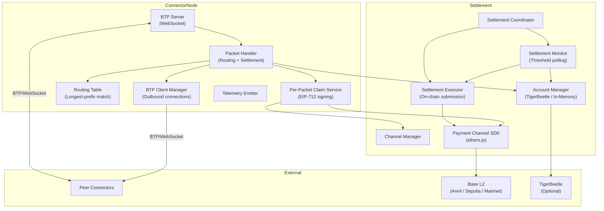
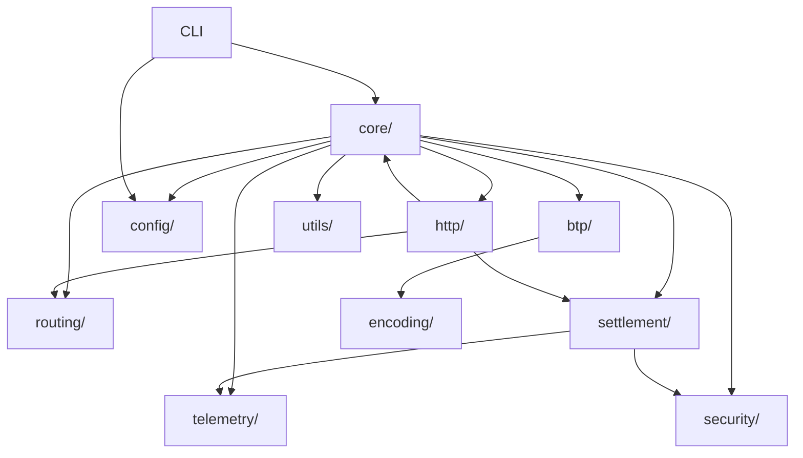
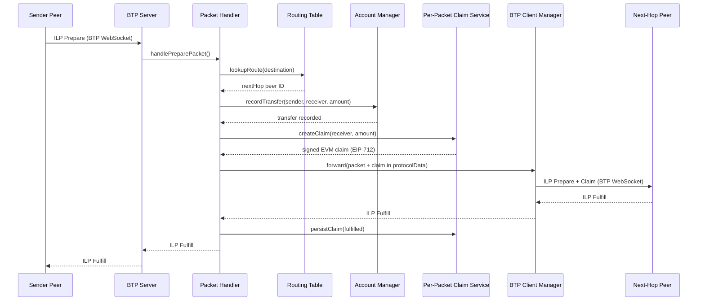
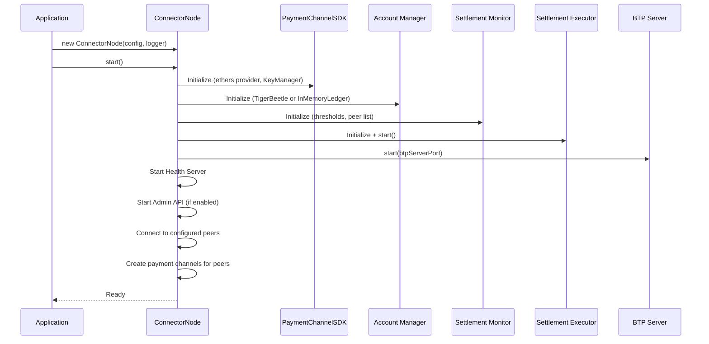
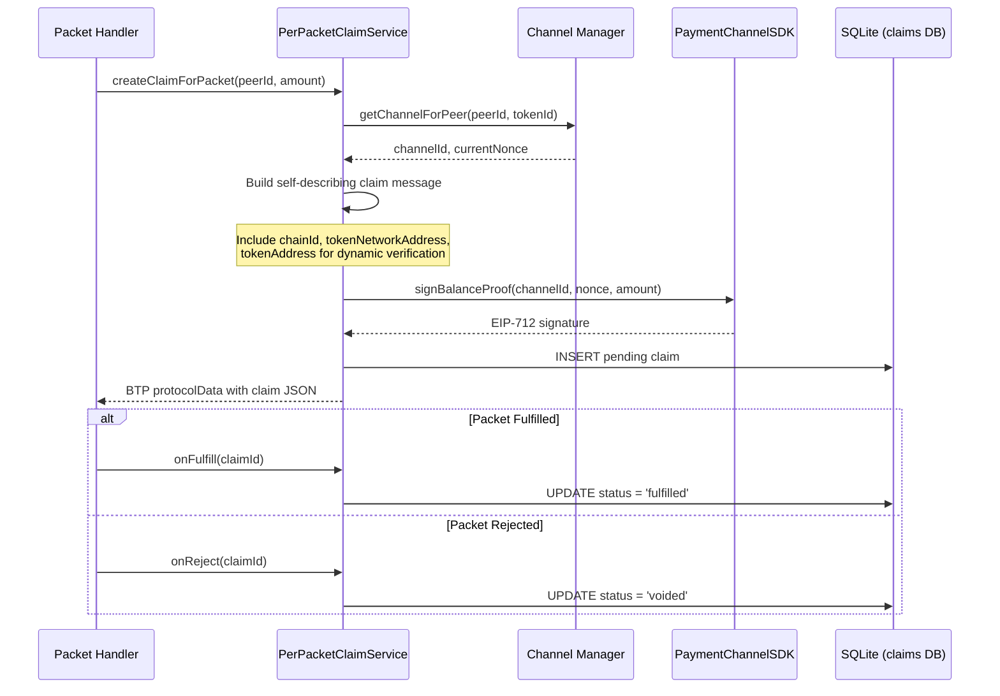
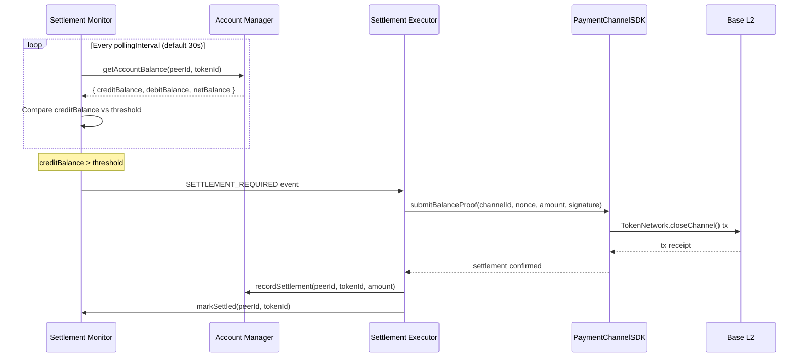

# Crosstown Connector - Architecture Documentation

## Table of Contents

- [1. Introduction](#1-introduction)
- [2. High-Level Architecture](#2-high-level-architecture)
- [3. Monorepo Structure](#3-monorepo-structure)
- [4. Tech Stack](#4-tech-stack)
- [5. Connector Module Architecture](#5-connector-module-architecture)
- [6. Data Models](#6-data-models)
- [7. Core Workflows](#7-core-workflows)
- [8. Settlement Architecture](#8-settlement-architecture)
- [9. Configuration](#9-configuration)
- [10. Security](#10-security)
- [11. Error Handling](#11-error-handling)
- [12. Testing Strategy](#12-testing-strategy)
- [13. Key Design Decisions](#13-key-design-decisions)
- [14. RFC References](#14-rfc-references)

---

## 1. Introduction

**Crosstown Connector** (`@crosstown/connector` v1.6.2) is a production-ready
Interledger Protocol (ILP) connector for machine-to-machine payment routing with
EVM settlement on Base L2.

### Capabilities

- **ILP packet routing** — Longest-prefix matching with static routing tables and BTP transport (RFC-0023, RFC-0027)
- **Balance tracking** — Double-entry accounting via TigerBeetle or in-memory ledger with snapshot persistence
- **EVM settlement** — Raiden-style payment channels on Base L2 with threshold-based on-chain settlement
- **Per-packet claims** — Self-describing EIP-712 signed claims attached to every forwarded packet (Epic 31)
- **Multi-deployment modes** — Library (embedded), CLI (standalone), or Docker container

### How to Read This Document

Sections 2-5 describe the static architecture (structure, modules, dependencies).
Sections 6-8 describe runtime behavior (data flow, settlement, claims).
Sections 9-12 cover operational concerns (config, security, testing).
Sections 13-14 capture rationale and standards compliance.

---

## 2. High-Level Architecture

### Architectural Style

Monorepo library with containerized deployment option. The primary artifact is an
npm package (`@crosstown/connector`) that can be imported as a library, run as a
CLI, or deployed as a Docker container.

### Principles

1. **Library-first** — The connector is designed to be embedded in application code via `new ConnectorNode(config, logger)`. Standalone mode is an opt-in deployment pattern.
2. **Observability-first** — Every packet, balance change, settlement event, and claim is emitted as a structured telemetry event.
3. **RFC-compliant** — Core protocols follow Interledger RFCs (ILPv4, BTP, OER encoding, ILP addressing).
4. **EVM-only settlement** — Settlement is exclusively on EVM chains (Base L2). XRP and Aptos support were removed in Epic 30.

### System Diagram



### Primary Data Flow

1. Peer sends ILP Prepare packet over BTP WebSocket
2. BTPServer deserializes and passes to PacketHandler
3. PacketHandler queries RoutingTable for longest-prefix match
4. AccountManager records double-entry transfer (debit sender, credit receiver)
5. PerPacketClaimService signs an EIP-712 claim and attaches it to BTP protocolData
6. PacketHandler forwards packet to next-hop peer via BTPClientManager
7. On fulfillment, claim is persisted to SQLite; on reject, claim is voided
8. SettlementMonitor polls balances and triggers on-chain settlement when thresholds are exceeded

---

## 3. Monorepo Structure

```
connector/
├── packages/
│   ├── connector/          # Core connector (main package)
│   ├── shared/             # ILP types, OER encoding, telemetry types
│   └── contracts/          # Solidity smart contracts (Foundry)
├── tools/
│   ├── send-packet/        # CLI tool for sending test packets
│   ├── fund-peers/         # CLI tool for funding peer accounts
│   └── create-test-accounts.ts  # Utility for creating test accounts
├── monitoring/             # Prometheus, Grafana, Alertmanager configs
├── Dockerfile              # Multi-stage build (builder → runtime)
└── docs-archive/           # Archived documentation
```

### Packages

| Package                    | Path                 | Description                                                                                   |
| -------------------------- | -------------------- | --------------------------------------------------------------------------------------------- |
| `@crosstown/connector`     | `packages/connector` | Core ILP connector with BTP, routing, settlement                                              |
| `@crosstown/shared` v1.2.0 | `packages/shared`    | ILP packet types, OER encoding/decoding, telemetry event types, routing types                 |
| `contracts`                | `packages/contracts` | Solidity contracts: `TokenNetwork.sol`, `TokenNetworkRegistry.sol` (Foundry, Solidity 0.8.26) |

### Tools

| Tool                   | Path                            | Description                                         |
| ---------------------- | ------------------------------- | --------------------------------------------------- |
| `send-packet`          | `tools/send-packet`             | Send ILP Prepare packets to a connector for testing |
| `fund-peers`           | `tools/fund-peers`              | Fund peer EVM accounts with test tokens             |
| `create-test-accounts` | `tools/create-test-accounts.ts` | Create test accounts for development                |

---

## 4. Tech Stack

| Category                  | Technology                        | Version           |
| ------------------------- | --------------------------------- | ----------------- |
| Language                  | TypeScript                        | ^5.3.3            |
| Runtime                   | Node.js                           | >=22.11.0         |
| Transport                 | WebSocket (ws)                    | ^8.16.0           |
| HTTP                      | Express                           | 4.18.x            |
| EVM                       | ethers.js                         | ^6.16.0           |
| Logging                   | pino                              | ^8.21.0           |
| Config                    | js-yaml                           | ^4.1.0            |
| Validation                | zod                               | ^3.25.76          |
| Database (claims)         | better-sqlite3                    | ^11.8.1           |
| Accounting (optional)     | TigerBeetle                       | 0.16.68           |
| Smart Contracts           | Solidity 0.8.26 (Foundry)         | —                 |
| AI (optional)             | @ai-sdk/anthropic, @ai-sdk/openai | ^1.2.12 / ^1.3.24 |
| Observability (optional)  | OpenTelemetry, prom-client        | ^1.9.0 / ^15.1.0  |
| Key Management (optional) | AWS KMS, GCP KMS, Azure Key Vault | —                 |
| Testing                   | Jest + ts-jest                    | ^29.7.0 / ^29.1.2 |
| Build                     | tsc, tsx, Vite                    | —                 |

---

## 5. Connector Module Architecture

The connector source lives in `packages/connector/src/` with 17 module directories:

| Module        | Directory        | Description                                                                                                |
| ------------- | ---------------- | ---------------------------------------------------------------------------------------------------------- |
| Core          | `core/`          | `ConnectorNode` orchestrator, `PacketHandler` routing/forwarding, `PaymentHandler`                         |
| BTP           | `btp/`           | BTP server, client, client manager, claim types (RFC-0023)                                                 |
| Routing       | `routing/`       | `RoutingTable` with longest-prefix matching                                                                |
| Settlement    | `settlement/`    | Payment channels, claim signing, accounting, monitoring, execution, coordination                           |
| Wallet        | `wallet/`        | Treasury wallet, seed manager, wallet auth/security, audit logger, fraud detector, rate limiter            |
| Security      | `security/`      | `KeyManager` (5 backends), `KeyRotationManager`, fraud detection rules, rate limiting, reputation tracking |
| HTTP          | `http/`          | Health server, admin API server, admin REST endpoints                                                      |
| Config        | `config/`        | `ConfigLoader`, YAML parsing, type definitions                                                             |
| Telemetry     | `telemetry/`     | `TelemetryEmitter`, structured event types                                                                 |
| Observability | `observability/` | Prometheus metrics, OpenTelemetry tracing                                                                  |
| CLI           | `cli/`           | Command-line interface (`connector` binary)                                                                |
| Encoding      | `encoding/`      | OER encoding utilities (RFC-0030)                                                                          |
| Facilitator   | `facilitator/`   | SPSP client for payment setup (RFC-0009)                                                                   |
| Discovery     | `discovery/`     | `PeerDiscoveryService` for dynamic peer discovery                                                          |
| Performance   | `performance/`   | Batching, buffering, connection pooling for high TPS                                                       |
| Utils         | `utils/`         | Logger, optional-require, general utilities                                                                |
| Test Utils    | `test-utils/`    | Test helpers, mocks, fixtures                                                                              |

### Module Dependency Graph



---

## 6. Data Models

### ILP Packets (`@crosstown/shared`)

| Type               | Fields                                                                                | RFC      |
| ------------------ | ------------------------------------------------------------------------------------- | -------- |
| `ILPPreparePacket` | `destination`, `amount` (bigint), `executionCondition` (32-byte), `expiresAt`, `data` | RFC-0027 |
| `ILPFulfillPacket` | `fulfillment` (32-byte preimage), `data`                                              | RFC-0027 |
| `ILPRejectPacket`  | `code` (ILPErrorCode), `triggeredBy`, `message`, `data`                               | RFC-0027 |

### BTP Claim Messages (`btp/btp-claim-types.ts`)

```typescript
interface EVMClaimMessage {
  version: '1.0';
  blockchain: 'evm';
  messageId: string;
  timestamp: string; // ISO 8601
  senderId: string; // Peer ID
  channelId: string; // bytes32 hex (0x-prefixed)
  nonce: number; // Monotonically increasing
  transferredAmount: string; // Cumulative (bigint as string)
  lockedAmount: string;
  locksRoot: string; // 32-byte hex
  signature: string; // EIP-712 typed signature
  signerAddress: string; // 0x-prefixed Ethereum address
  // Self-describing fields (Epic 31)
  chainId?: number; // EVM chain ID
  tokenNetworkAddress?: string; // TokenNetwork contract address
  tokenAddress?: string; // ERC20 token address
}
```

Claims are transmitted via BTP protocolData with protocol name `payment-channel-claim` and content type `1` (JSON).

### Configuration Types (`config/types.ts`)

Key interfaces:

- `ConnectorConfig` — Top-level config (nodeId, peers, routes, settlement, adminApi, deploymentMode)
- `PeerConfig` — Peer connection (id, url, authToken, evmAddress)
- `RouteConfig` — Static route (prefix, nextHop, priority)
- `SettlementConfig` — TigerBeetle accounting params (fees, credit limits, thresholds)
- `SettlementInfraConfig` — EVM infrastructure params (rpcUrl, registryAddress, privateKey, threshold)
- `AdminApiConfig` — Admin REST API (port, apiKey, allowedIPs, trustProxy)
- `DeploymentMode` — `'embedded' | 'standalone'`

### Settlement Types (`settlement/types.ts`)

- `PeerConfig` (settlement) — Peer settlement preferences, EVM address, token/chain info
- `AdminSettlementConfig` — Settlement params received via admin API
- `ChannelMetadata` — Channel state tracking (channelId, status, deposits, nonces)

---

## 7. Core Workflows

### Packet Forwarding (Multi-Hop) with Per-Packet Claims



### Connector Startup Sequence



### Per-Packet Claim Flow (Epic 31)



### Settlement Lifecycle



---

## 8. Settlement Architecture

### Overview

Settlement is exclusively EVM-based on Base L2. XRP and Aptos settlement support was removed in Epic 30. The system uses Raiden-style payment channels with EIP-712 typed signatures.

### Components

| Component                   | File                                        | Purpose                                                                            |
| --------------------------- | ------------------------------------------- | ---------------------------------------------------------------------------------- |
| `PaymentChannelSDK`         | `settlement/payment-channel-sdk.ts`         | Low-level EVM interaction (ethers.js provider, contract calls, signature creation) |
| `ChannelManager`            | `settlement/channel-manager.ts`             | Channel lifecycle (create, deposit, close), peer-to-channel mapping                |
| `PerPacketClaimService`     | `settlement/per-packet-claim-service.ts`    | Signs and attaches EIP-712 claims to every forwarded packet (Epic 31)              |
| `ClaimReceiver`             | `settlement/claim-receiver.ts`              | Validates and processes incoming claims from peers                                 |
| `ClaimSender`               | `settlement/claim-sender.ts`                | Manages outbound claim delivery                                                    |
| `ClaimRedemptionService`    | `settlement/claim-redemption-service.ts`    | Redeems accumulated claims on-chain                                                |
| `EIP712Helper`              | `settlement/eip712-helper.ts`               | EIP-712 typed data construction and signature utilities                            |
| `AccountManager`            | `settlement/account-manager.ts`             | Double-entry balance tracking (TigerBeetle or InMemoryLedger)                      |
| `AccountIdGenerator`        | `settlement/account-id-generator.ts`        | Generates unique account IDs for ledger entries                                    |
| `AccountMetadata`           | `settlement/account-metadata.ts`            | Account metadata management and storage                                            |
| `LedgerClient`              | `settlement/ledger-client.ts`               | Abstract ledger client interface                                                   |
| `SettlementMonitor`         | `settlement/settlement-monitor.ts`          | Polls balances, emits SETTLEMENT_REQUIRED when threshold exceeded                  |
| `SettlementExecutor`        | `settlement/settlement-executor.ts`         | Executes on-chain settlement transactions                                          |
| `SettlementCoordinator`     | `settlement/settlement-coordinator.ts`      | Coordinates settlement workflow across monitor and executor                        |
| `SettlementApi`             | `settlement/settlement-api.ts`              | REST API endpoints for settlement operations                                       |
| `UnifiedSettlementExecutor` | `settlement/unified-settlement-executor.ts` | Unified settlement orchestration                                                   |
| `MetricsCollector`          | `settlement/metrics-collector.ts`           | Collects and exposes settlement metrics                                            |
| `TigerBeetleClient`         | `settlement/tigerbeetle-client.ts`          | TigerBeetle connection and transfer operations                                     |
| `TigerBeetleBatchWriter`    | `settlement/tigerbeetle-batch-writer.ts`    | Batched write operations for TigerBeetle                                           |
| `TigerBeetleErrors`         | `settlement/tigerbeetle-errors.ts`          | TigerBeetle-specific error types and handling                                      |
| `InMemoryLedgerClient`      | `settlement/in-memory-ledger-client.ts`     | In-memory ledger with JSON snapshot persistence (fallback)                         |

### Channel Registration

Channels can be registered through three methods:

1. **Admin API** — `POST /admin/channels` with explicit channel parameters
2. **At-connection** — Channels created automatically when BTP peers connect (if settlement infrastructure is enabled)
3. **Dynamic verification** (Epic 31) — Self-describing claims include `chainId`, `tokenNetworkAddress`, and `tokenAddress`, enabling the receiver to verify unknown channels on-chain without pre-registration

### Self-Describing Claims (Epic 31)

Each claim message includes optional fields that make it self-describing:

```json
{
  "version": "1.0",
  "blockchain": "evm",
  "channelId": "0x...",
  "nonce": 42,
  "transferredAmount": "1000000",
  "signature": "0x...",
  "signerAddress": "0x...",
  "chainId": 8453,
  "tokenNetworkAddress": "0x...",
  "tokenAddress": "0x..."
}
```

These fields are cryptographically bound to the EIP-712 signature via the domain separator (`chainId` and `tokenNetworkAddress` are part of the signing domain), preventing spoofing.

### Smart Contracts (Foundry)

| Contract                   | Path                      | Purpose                                                   |
| -------------------------- | ------------------------- | --------------------------------------------------------- |
| `TokenNetwork.sol`         | `packages/contracts/src/` | Payment channel operations (open, deposit, close, settle) |
| `TokenNetworkRegistry.sol` | `packages/contracts/src/` | Registry for TokenNetwork instances per ERC-20 token      |

Contracts are compiled and tested with **Foundry** (`forge build`, `forge test`). Deployment scripts are in `packages/contracts/script/`.

---

## 9. Configuration

### Sources (Precedence: highest to lowest)

1. **Environment variables** — Override any config value
2. **YAML file** — Passed as path to `ConnectorNode` constructor
3. **Programmatic object** — Passed directly to `ConnectorNode` constructor
4. **Defaults** — Built-in defaults in `ConfigLoader`

### Minimal YAML Example

```yaml
nodeId: my-connector
btpServerPort: 3000
environment: development

peers:
  - id: peer1
    url: ws://peer1:3001
    authToken: secret-token

routes:
  - prefix: g.peer1
    nextHop: peer1
```

### Deployment Modes

| Mode           | Declaration                  | Packet Input                                | Packet Output                  | Admin API          |
| -------------- | ---------------------------- | ------------------------------------------- | ------------------------------ | ------------------ |
| **Embedded**   | `deploymentMode: embedded`   | `setPacketHandler()` callback               | `node.sendPacket()`            | Typically disabled |
| **Standalone** | `deploymentMode: standalone` | HTTP POST to BLS `/handle-packet`           | HTTP POST to `/admin/ilp/send` | Enabled            |
| **Inferred**   | (omitted)                    | Based on `localDelivery` + `adminApi` flags | Based on flags                 | Based on flags     |

### Key ConnectorConfig Fields

| Field             | Type                  | Default              | Description                                             |
| ----------------- | --------------------- | -------------------- | ------------------------------------------------------- |
| `nodeId`          | string                | required             | Unique connector identifier                             |
| `btpServerPort`   | number                | required             | BTP WebSocket listen port                               |
| `healthCheckPort` | number                | 8080                 | HTTP health endpoint port                               |
| `logLevel`        | string                | `'info'`             | `debug`, `info`, `warn`, `error`                        |
| `environment`     | string                | `'development'`      | `development`, `staging`, `production`                  |
| `deploymentMode`  | string                | inferred             | `embedded` or `standalone`                              |
| `peers`           | PeerConfig[]          | required             | Peer connector definitions                              |
| `routes`          | RouteConfig[]         | required             | Static routing table                                    |
| `settlement`      | SettlementConfig      | —                    | TigerBeetle accounting params                           |
| `settlementInfra` | SettlementInfraConfig | —                    | EVM settlement infrastructure                           |
| `adminApi`        | AdminApiConfig        | `{ enabled: false }` | Admin REST API settings                                 |
| `localDelivery`   | LocalDeliveryConfig   | `{ enabled: false }` | HTTP packet forwarding to BLS                           |
| `mode`            | string                | `'connector'`        | `connector` (standard) or `gateway` (messaging gateway) |
| `security`        | SecurityConfig        | —                    | Key management backend configuration                    |
| `performance`     | PerformanceConfig     | —                    | High-throughput optimization (batching, pooling)        |
| `blockchain`      | BlockchainConfig      | —                    | Base L2 chain configuration                             |

---

## 10. Security

### Authentication

- **BTP auth** — Shared secret tokens for peer-to-peer WebSocket connections
- **Admin API** — Optional API key via `X-Api-Key` header
- **IP allowlisting** — CIDR-based access control for admin API (checked before API key)
- **Deployment mode restrictions** — Embedded mode disables external HTTP interfaces by default

### Key Management

Five backends via `KeyManager`:

| Backend    | Use Case                                                      |
| ---------- | ------------------------------------------------------------- |
| `env`      | Development (private key from environment variable or config) |
| `aws-kms`  | Production (AWS Key Management Service)                       |
| `gcp-kms`  | Production (Google Cloud KMS)                                 |
| `azure-kv` | Production (Azure Key Vault)                                  |
| `hsm`      | Enterprise (Hardware Security Module via PKCS#11)             |

Key rotation is supported — new keys are used for signing while old keys remain valid for verification during a transition period.

### Fraud Detection

- **Duplicate claim detection** — Claims with previously-seen messageIds are rejected
- **Nonce validation** — Claim nonces must be monotonically increasing per channel
- **Signature verification** — EIP-712 signatures verified against expected signer address
- **Balance proof validation** — Transferred amounts must be non-decreasing (cumulative)
- **Replay protection** — Channel ID + nonce + chain ID prevent cross-chain and within-chain replay

### Additional Security

- Credit limits with per-peer and per-token granularity (configurable ceiling)
- Rate limiting on admin API endpoints
- Structured logging with correlation IDs (no sensitive data in logs)
- Production validation rejects known development private keys

---

## 11. Error Handling

### ILP Error Codes (RFC-0027)

| Prefix | Meaning           | Examples                                                                   |
| ------ | ----------------- | -------------------------------------------------------------------------- |
| `F__`  | Final (permanent) | `F00` Bad Request, `F01` Invalid Packet, `F02` Unreachable                 |
| `T__`  | Temporary (retry) | `T00` Internal Error, `T01` Peer Unreachable, `T04` Insufficient Liquidity |
| `R__`  | Relative (amount) | `R01` Insufficient Source Amount, `R02` Insufficient Timeout               |

### BTP Reconnection

Failed BTP connections use exponential backoff with jitter. The `BTPClientManager` automatically retries peer connections in the background without blocking connector startup.

### Resilience Patterns

- **Non-blocking telemetry** — Telemetry failures never prevent packet forwarding
- **Graceful settlement degradation** — If payment channel infrastructure fails to initialize, the connector continues without settlement
- **Structured logging** — All log entries include correlation IDs (`event`, `nodeId`, `peerId`) for distributed tracing

---

## 12. Testing Strategy

### Framework

Jest + ts-jest with co-located test files (`*.test.ts` next to source).

### Test Types

| Type        | Command                    | Scope                                   |
| ----------- | -------------------------- | --------------------------------------- |
| Unit        | `npm test`                 | Individual modules, mocked dependencies |
| Acceptance  | `npm run test:acceptance`  | User story acceptance criteria          |
| Security    | `npm run test:security`    | Auth, key management, input validation  |
| Load        | `npm run test:load`        | Throughput and latency benchmarks       |
| Performance | `npm run test:performance` | Performance regression detection        |

### Domain-Specific Test Suites

```bash
npm run test:settlement   # Settlement and claim tests
npm run test:btp          # BTP protocol tests
npm run test:tigerbeetle  # TigerBeetle and accounting tests
npm run test:evm          # EVM settlement tests
```

---

## 13. Key Design Decisions

| Decision                        | Rationale                                                                                                                                     |
| ------------------------------- | --------------------------------------------------------------------------------------------------------------------------------------------- |
| **EVM-only settlement**         | XRP/Aptos removed in Epic 30 to reduce complexity. Base L2 chosen for low fees and EVM compatibility.                                         |
| **Per-packet claims (Epic 31)** | Every forwarded packet carries an EIP-712 signed claim, enabling continuous micropayment settlement without batching delays.                  |
| **Self-describing claims**      | Claims include chain ID, token network address, and token address so receivers can verify unknown channels on-chain without pre-registration. |
| **Foundry (not Hardhat)**       | Faster compilation, built-in fuzzing, Solidity-native tests, better developer experience.                                                     |
| **TigerBeetle optional**        | In-memory ledger with JSON snapshot persistence provides a zero-dependency fallback. TigerBeetle is recommended for production.               |
| **Library-first**               | `ConnectorNode` is a class you instantiate in your code. CLI and Docker are wrappers around this library API.                                 |
| **better-sqlite3 for claims**   | Per-packet claim persistence needs synchronous, low-latency writes. SQLite is embedded and requires no external service.                      |
| **In-memory ledger snapshots**  | JSON file snapshots every 30s (configurable) provide persistence across restarts without TigerBeetle.                                         |
| **BTP over WebSocket**          | RFC-0023 compliant. WebSocket provides full-duplex, low-latency communication for bilateral transfers and claim exchange.                     |

---

## 14. RFC References

| RFC                                                                        | Title                             | Implementation                                                             |
| -------------------------------------------------------------------------- | --------------------------------- | -------------------------------------------------------------------------- |
| [RFC-0027](https://interledger.org/rfcs/0027-interledger-protocol-v4/)     | Interledger Protocol v4 (ILPv4)   | Packet types, error codes, routing in `@crosstown/shared` and `core/`      |
| [RFC-0023](https://interledger.org/rfcs/0023-bilateral-transfer-protocol/) | Bilateral Transfer Protocol (BTP) | `btp/` module — WebSocket transport, auth, protocolData for claims         |
| [RFC-0030](https://interledger.org/rfcs/0030-notes-on-oer-encoding/)       | OER Encoding                      | `@crosstown/shared` encoding module — packet serialization/deserialization |
| [RFC-0015](https://interledger.org/rfcs/0015-ilp-addresses/)               | ILP Addresses                     | Address validation, longest-prefix routing in `routing/`                   |
| [RFC-0001](https://interledger.org/rfcs/0001-interledger-architecture/)    | Interledger Architecture          | Overall connector architecture and protocol layering                       |
