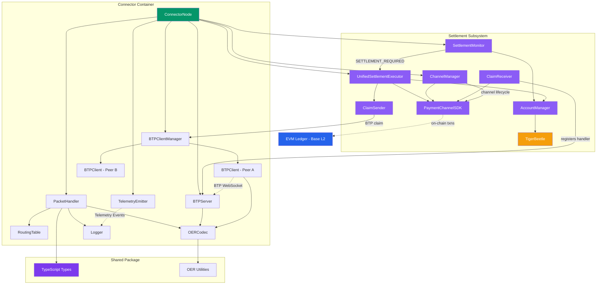

# Components

## ConnectorNode

**Responsibility:** Core ILP connector service that receives, routes, and forwards ILP packets according to RFC-0027. Manages BTP connections to peer connectors and emits telemetry for observability.

**Key Interfaces:**

- `handleIncomingPacket(packet: ILPPacket): Promise<ILPPacket>` - Process received packet and return response
- `forwardPacket(packet: ILPPreparePacket, nextHop: string): Promise<void>` - Forward to peer via BTP
- `getRoutingTable(): RoutingTableEntry[]` - Export current routes for inspection
- `getHealthStatus(): HealthStatus` - Report connector operational status

**Dependencies:**

- PacketHandler (packet processing logic)
- RoutingTable (route lookups)
- BTPServer (accept incoming connections)
- BTPClientManager (manage outbound connections)
- TelemetryEmitter (emit events for monitoring)
- Logger (structured logging)

**Technology Stack:** TypeScript, Node.js 20, Pino logger, ws library for WebSocket, Express for health endpoint

## PacketHandler

**Responsibility:** Implements ILPv4 packet forwarding logic including validation, expiry checking, routing table lookup, and error generation per RFC-0027. Supports per-hop BLS notification where every connector in the path can notify its local Business Logic Server.

**Key Interfaces:**

- `processPrepare(packet: ILPPreparePacket): Promise<ILPFulfillPacket | ILPRejectPacket>` - Process Prepare packet
- `validatePacket(packet: ILPPacket): ValidationResult` - Validate packet structure and expiry
- `generateReject(code: ILPErrorCode, message: string): ILPRejectPacket` - Create reject packet

**Per-Hop BLS Notification:**

PacketHandler operates in two modes depending on whether the connector is the final hop:

- **Final hop** (`nextHop === nodeId` or `'local'`): Awaits the BLS response via `LocalDeliveryClient.deliver()`. The BLS returns `{ accept: true/false }`, and the connector computes the fulfillment (`SHA-256(packet.data)`) or maps the reject code accordingly. This is the blocking path — the BLS decides the payment outcome.
- **Intermediate hop** (`nextHop === peerId`): Fires a non-blocking `LocalDeliveryClient.deliver()` call (fire-and-forget with `.catch(noop)`) to notify the local BLS, then forwards the packet unchanged to the next hop via BTP. The BLS notification is a pure side-effect — failures do not affect forwarding.

Both modes send the same `PaymentRequest` payload (`paymentId`, `destination`, `amount`, `expiresAt`, `data`) to the BLS.

**Dependencies:**

- RoutingTable (determine next hop)
- BTPClientManager (send to next hop)
- LocalDeliveryClient (BLS notification — blocking at final hop, fire-and-forget at intermediate hops)
- Logger (log routing decisions)

**Technology Stack:** Pure TypeScript business logic with minimal external dependencies

## RoutingTable

**Responsibility:** Maintains in-memory mapping of ILP address prefixes to next-hop peers. Implements longest-prefix matching algorithm per RFC-0027 routing requirements.

**Key Interfaces:**

- `addRoute(prefix: string, nextHop: string): void` - Add routing entry
- `removeRoute(prefix: string): void` - Remove routing entry
- `lookup(destination: ILPAddress): string | null` - Find next-hop peer using longest-prefix match
- `getAllRoutes(): RoutingTableEntry[]` - Export all routes

**Dependencies:** None (pure data structure)

**Technology Stack:** TypeScript with Map-based storage, optimized for O(log n) prefix matching

## BTPServer

**Responsibility:** WebSocket server accepting incoming BTP connections from peer connectors. Implements RFC-0023 authentication and message parsing.

**Key Interfaces:**

- `start(port: number): Promise<void>` - Start listening for connections
- `onConnection(callback: (peerId: string, connection: WebSocket) => void)` - Connection event handler
- `onMessage(callback: (peerId: string, message: BTPMessage) => void)` - Message received handler
- `stop(): Promise<void>` - Graceful shutdown

**Dependencies:**

- ws library (WebSocket server)
- BTPMessageParser (decode BTP frames)
- Logger

**Technology Stack:** ws library 8.16.x, Custom BTP protocol implementation per RFC-0023

## BTPClient

**Responsibility:** WebSocket client for outbound BTP connections to peer connectors. Handles connection lifecycle, authentication, and packet transmission.

**Key Interfaces:**

- `connect(url: string, authToken: string): Promise<void>` - Establish BTP connection
- `sendPacket(packet: ILPPacket): Promise<void>` - Send ILP packet wrapped in BTP MESSAGE
- `onPacket(callback: (packet: ILPPacket) => void)` - Incoming packet handler
- `disconnect(): Promise<void>` - Close connection gracefully

**Dependencies:**

- ws library (WebSocket client)
- BTPMessageParser (encode/decode BTP)
- Logger

**Technology Stack:** ws library 8.16.x, Reconnection logic with exponential backoff

## BTPClientManager

**Responsibility:** Manages multiple BTPClient instances (one per peer). Tracks connection state and routes packets to appropriate client based on peer ID.

**Key Interfaces:**

- `addPeer(peer: Peer): Promise<void>` - Create and connect BTP client for peer
- `removePeer(peerId: string): Promise<void>` - Disconnect and remove peer
- `sendToPeer(peerId: string, packet: ILPPacket): Promise<void>` - Send packet to specific peer
- `getPeerStatus(): Map<string, boolean>` - Get connection state for all peers

**Dependencies:**

- BTPClient (manages instances)
- Logger

**Technology Stack:** TypeScript Map-based client registry

## OERCodec

**Responsibility:** Encode and decode ILP packets to/from binary format using OER (Octet Encoding Rules) per RFC-0030.

**Key Interfaces:**

- `serializePacket(packet: ILPPacket): Buffer` - Encode to binary
- `deserializePacket(buffer: Buffer): ILPPacket` - Decode from binary
- `serializePrepare(packet: ILPPreparePacket): Buffer` - Encode Prepare packet
- `deserializePrepare(buffer: Buffer): ILPPreparePacket` - Decode Prepare packet
- (Similar methods for Fulfill and Reject)

**Dependencies:** Node.js Buffer API

**Technology Stack:** Pure TypeScript implementation, Reference: RFC-0030 and existing ilp-packet library for validation

## TelemetryEmitter

**Responsibility:** Emits telemetry events from connector for monitoring and observability. Events can be consumed by logging systems, metrics collectors, or future visualization tools.

**Key Interfaces:**

- `emit(event: TelemetryEvent): void` - Emit telemetry event (logged to stdout)
- `emitNodeStatus(routes: RoutingTableEntry[], peers: Peer[]): void` - Emit node status event
- `emitPacketReceived(packet: ILPPacket): void` - Emit packet received event
- `emitPacketSent(packetId: string, nextHop: string): void` - Emit packet sent event
- `emitRouteLookup(destination: string, selectedPeer: string, reason: string): void` - Emit routing decision

**Dependencies:**

- Logger

**Technology Stack:** Event emission to structured logging system, JSON serialization for telemetry events

**Note:** Dashboard visualization deferred - see DASHBOARD-DEFERRED.md in root

## TestPacketSender (CLI Tool)

**Responsibility:** Command-line utility for injecting test ILP packets into the network to observe routing behavior.

**Key Interfaces:**

- CLI: `send-packet --source <nodeId> --destination <address> --amount <value> [--data <payload>]`
- `createTestPrepare(destination: string, amount: bigint): ILPPreparePacket` - Generate valid packet
- `sendToConnector(nodeUrl: string, packet: ILPPacket): Promise<void>` - Send via BTP

**Dependencies:**

- BTPClient (connect to target connector)
- OERCodec (serialize packet)
- Commander.js (CLI argument parsing)

**Technology Stack:** Node.js CLI script, TypeScript compiled to executable

## UnifiedSettlementExecutor

**Responsibility:** Executes EVM settlement operations for peers. Listens for SETTLEMENT_REQUIRED events and settles via EVM payment channels on Base L2.

**Key Interfaces:**

- `start(): void` - Start settlement executor (register event listeners)
- `stop(): void` - Stop settlement executor (unregister event listeners)
- `handleSettlement(event: SettlementRequiredEvent): Promise<void>` - Private method handling settlement execution

**Settlement Logic:**

```typescript
// Peer supports EVM → EVM settlement
if (canUseEVM && peerConfig.evmAddress) {
  await settleViaEVM(peerId, amount, tokenAddress, peerConfig);
} else {
  throw new Error(`No compatible settlement method`);
}
```

**Dependencies:**

- PaymentChannelSDK (EVM settlements)
- SettlementMonitor (emits SETTLEMENT_REQUIRED events)
- AccountManager (TigerBeetle balance updates)
- Logger

**Technology Stack:** TypeScript event-driven architecture, integrates with TigerBeetle accounting layer

## ClaimSender

**Responsibility:** Sends signed payment channel claims to peers via BTP `payment-channel-claim` sub-protocol. Implements retry logic with exponential backoff, persists sent claims to SQLite for dispute resolution, and emits telemetry events.

**Key Interfaces:**

- `sendEVMClaim(peerId: string, btpClient: BTPClient, channelId: string, nonce: number, transferredAmount: string, lockedAmount: string, locksRoot: string, signature: string, signerAddress: string): Promise<ClaimSendResult>` - Send an EVM balance proof claim to a peer

**Epic 31 Impact:** Must populate optional `chainId`, `tokenNetworkAddress`, and `tokenAddress` fields in the claim message so unknown receivers can verify claims dynamically.

**Dependencies:**

- BTPClient (WebSocket transmission via protocolData)
- SQLite Database (claim persistence for dispute resolution)
- TelemetryEmitter (CLAIM_SENT events)
- Logger

**Technology Stack:** TypeScript, BTP protocol (RFC-0023), exponential backoff retry (3 attempts: 1s, 2s, 4s delays)

## ClaimReceiver

**Responsibility:** Receives and verifies payment channel claims from peers via BTP. Validates EIP-712 signatures, enforces nonce monotonicity (preventing replay attacks), persists verified claims to database, and emits telemetry events.

**Key Interfaces:**

- `registerWithBTPServer(btpServer: BTPServer): void` - Register claim protocol handler with BTP server
- `verifyEVMClaim(claim: EVMClaimMessage): Promise<ClaimVerificationResult>` - Verify an EVM claim (signature + monotonicity)
- `getLatestVerifiedClaim(channelId: string): Promise<EVMClaimMessage | null>` - Retrieve latest verified claim for a channel

**Epic 31 Impact:** Must add dynamic on-chain verification for claims from unknown channels — extract `chainId`, `tokenNetworkAddress`, `tokenAddress` from the self-describing claim, verify channel existence via RPC, then verify EIP-712 signature using the domain from the claim.

**Dependencies:**

- BTPServer (registers protocol handler for `'payment-channel-claim'`)
- PaymentChannelSDK (EIP-712 signature verification)
- SQLite Database (verified claim persistence)
- TelemetryEmitter (CLAIM_RECEIVED, CLAIM_VERIFIED events)
- Logger

**Technology Stack:** TypeScript, EIP-712 typed data verification, nonce monotonicity checks

## ChannelManager

**Responsibility:** Orchestrates full payment channel lifecycles — opens channels on-demand when settlements are needed, tracks channel activity, detects idle channels, and handles cooperative and unilateral closure flows. Maintains dual-indexed metadata cache (`channelId → metadata` and `peerId → tokenId → channelId`).

**Key Interfaces:**

- `start(): void` - Start idle channel monitoring (periodic checks)
- `stop(): void` - Stop monitoring and cleanup timers
- `openChannel(peerId: string, tokenId: string, options?: ChannelOpenOptions): Promise<string>` - Open a new payment channel, returns channelId
- `getChannelForPeer(peerId: string, tokenId: string): ChannelMetadata | undefined` - Look up channel by peer and token
- `getChannelMetadata(channelId: string): ChannelMetadata | undefined` - Look up channel by ID
- `markChannelActivity(channelId: string): void` - Update last activity timestamp (called on settlement)

**Epic 31 Impact:** Must accept externally-discovered channels — when ClaimReceiver verifies a self-describing claim from an unknown peer, ChannelManager registers the channel metadata without having opened it.

**Dependencies:**

- PaymentChannelSDK (on-chain channel operations)
- SettlementExecutor (listens for CHANNEL_ACTIVITY events)
- TelemetryEmitter (PAYMENT_CHANNEL_OPENED, BALANCE_UPDATE, SETTLED events)
- Logger

**Technology Stack:** TypeScript, EventEmitter, interval-based idle detection

## PaymentChannelSDK

**Responsibility:** Low-level SDK wrapping ethers.js for EVM payment channel operations on Base L2. Manages TokenNetwork contract interactions, EIP-712 balance proof signing/verification, channel state queries, and on-chain event listening.

**Key Interfaces:**

- `static fromConnectionPool(pool: EVMRPCConnectionPool, keyManager: KeyManager, evmKeyId: string, registryAddress: string, logger: Logger): PaymentChannelSDK` - Factory method using RPC connection pool
- `openChannel(tokenAddress: string, participant2: string, settlementTimeout: number): Promise<string>` - Open channel on-chain, returns channelId
- `signBalanceProof(channelId: string, tokenNetworkAddress: string, nonce: number, transferredAmount: bigint, lockedAmount: bigint, locksRoot: string): Promise<string>` - Sign EIP-712 balance proof
- `verifyBalanceProof(channelId: string, tokenNetworkAddress: string, nonce: number, transferredAmount: bigint, lockedAmount: bigint, locksRoot: string, signature: string): Promise<string>` - Verify EIP-712 signature, returns signer address
- `closeChannel(channelId: string, tokenNetworkAddress: string, balanceProof: BalanceProof, signature: string): Promise<void>` - Initiate channel closure
- `settleChannel(channelId: string, tokenNetworkAddress: string): Promise<void>` - Settle after challenge period
- `cooperativeSettle(channelId: string, tokenNetworkAddress: string, ...): Promise<void>` - Cooperative close (no challenge period)
- `getChannelState(channelId: string, tokenNetworkAddress: string): Promise<ChannelState>` - Query on-chain channel state

**Epic 31 Impact:** Must support arbitrary `tokenNetworkAddress` and `chainId` values from self-describing claims rather than only pre-configured contracts.

**Dependencies:**

- ethers.js Provider/Signer (blockchain interactions)
- KeyManager (secure EIP-712 signing via key management backend)
- EIP-712 Helper (domain separator and type construction)
- Logger

**Technology Stack:** TypeScript, ethers.js v6, EIP-712 typed data, Solidity ABIs (TokenNetworkRegistry, TokenNetwork, ERC20)

## SettlementMonitor

**Responsibility:** Monitors peer account balances via periodic polling and emits SETTLEMENT_REQUIRED events when balances exceed configured thresholds. Implements a state machine (IDLE → SETTLEMENT_PENDING → SETTLEMENT_IN_PROGRESS → IDLE) to prevent duplicate triggers.

**Key Interfaces:**

- `start(): void` - Start periodic monitoring (default: 30s interval)
- `stop(): void` - Stop monitoring and cleanup timers
- `checkBalances(): Promise<void>` - Manual balance check (called by polling interval)

**Threshold Hierarchy:**

1. Token-specific threshold (highest priority)
2. Per-peer threshold
3. Default threshold
4. No threshold (monitoring disabled)

**Epic 31 Impact:** No changes required — SettlementMonitor operates on accounting balances, which are independent of how channels are discovered.

**Dependencies:**

- AccountManager (balance queries via TigerBeetle)
- TelemetryEmitter (SETTLEMENT_TRIGGERED events)
- Logger

**Technology Stack:** TypeScript, EventEmitter, interval-based polling, state machine

## AccountManager

**Responsibility:** Manages double-entry TigerBeetle accounting for peer settlement. Each peer-token combination has a DEBIT account (peer owes us) and CREDIT account (we owe peer). Supports deterministic account ID generation, credit limit enforcement, and batch writes for high-throughput settlement.

**Key Interfaces:**

- `ensureAccountPair(peerId: string, tokenId: string): Promise<PeerAccountPair>` - Create or retrieve account pair (idempotent)
- `recordDebit(peerId: string, tokenId: string, amount: bigint): Promise<void>` - Record amount peer owes us
- `recordCredit(peerId: string, tokenId: string, amount: bigint): Promise<void>` - Record amount we owe peer
- `getBalance(peerId: string, tokenId: string): Promise<PeerAccountBalance>` - Query debit, credit, and net balance
- `recordSettlement(peerId: string, tokenId: string, amount: bigint): Promise<void>` - Record settlement reducing outstanding balance
- `checkCreditLimit(peerId: string, tokenId: string, amount: bigint): Promise<CreditLimitViolation | null>` - Check if transaction would exceed credit limit

**Epic 31 Impact:** No changes required — AccountManager operates on abstract peer-token pairs, independent of channel discovery mechanism.

**Dependencies:**

- ILedgerClient (TigerBeetle or InMemoryLedgerClient)
- TigerBeetleBatchWriter (high-throughput batch operations)
- TelemetryEmitter (ACCOUNT_BALANCE events)
- EventStore/EventBroadcaster (standalone mode support)
- Logger

**Technology Stack:** TypeScript, TigerBeetle (128-bit account IDs, double-entry bookkeeping), deterministic ID generation via SHA-256

## Component Diagrams


