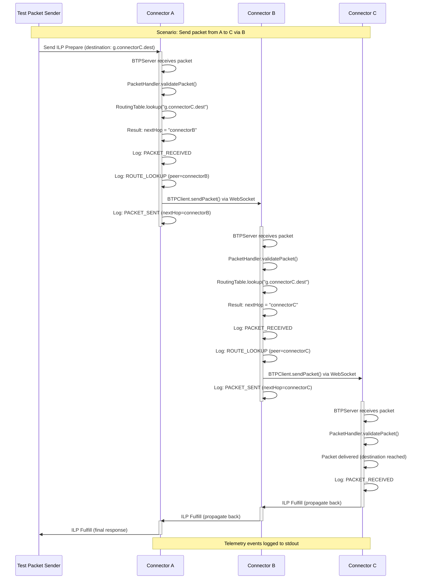
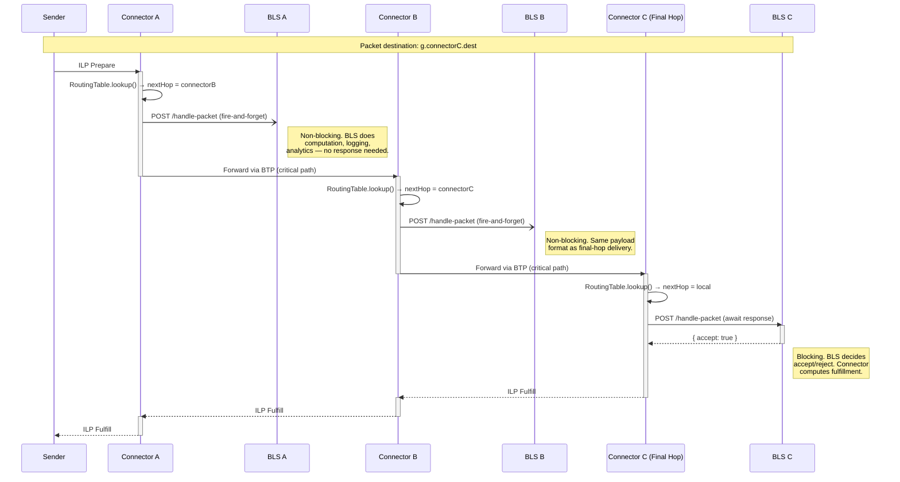
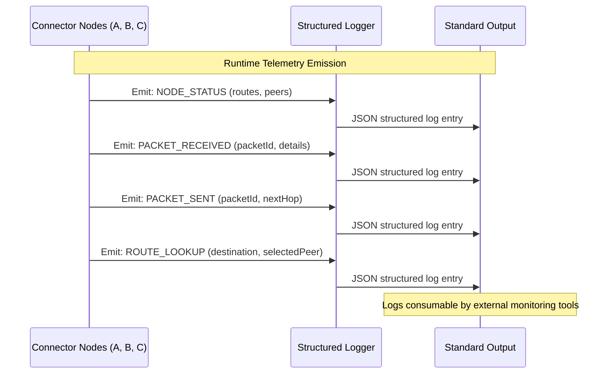
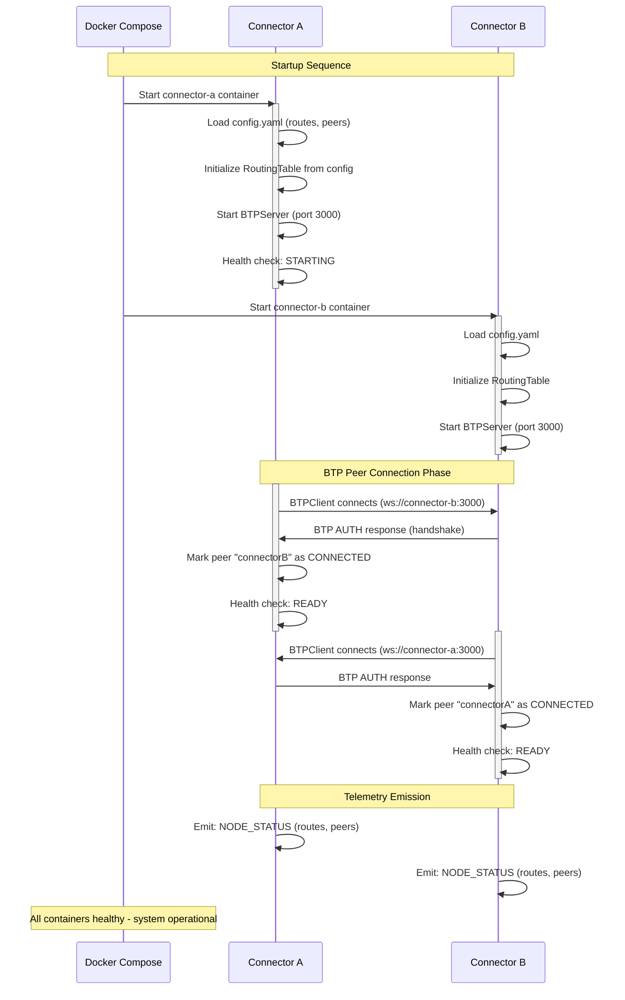
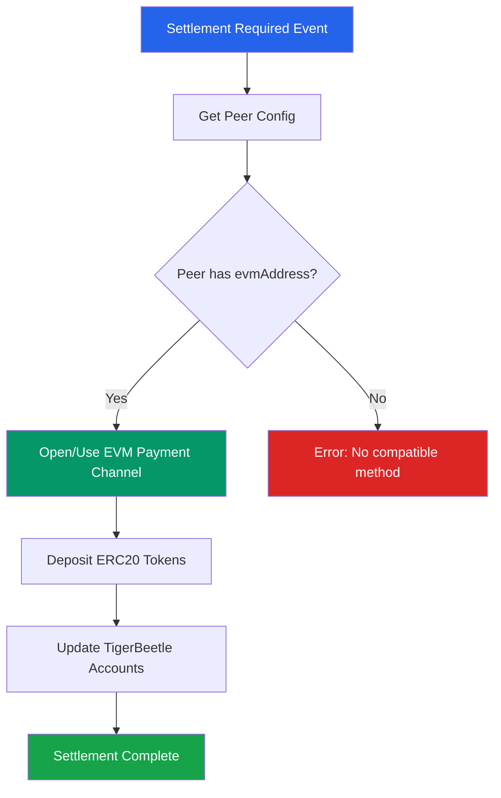
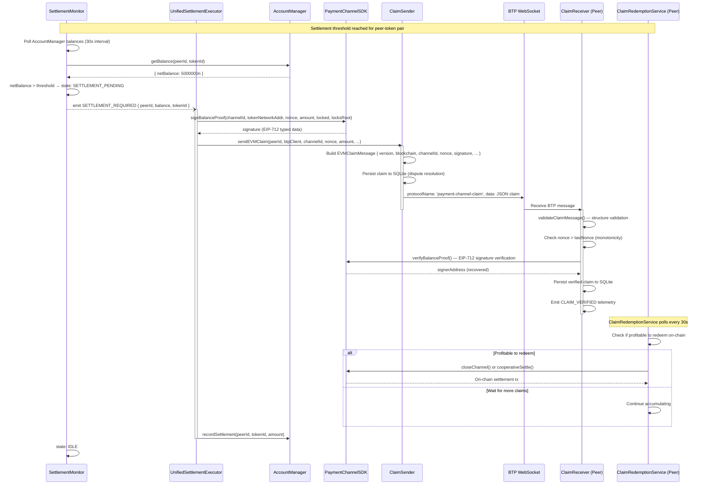
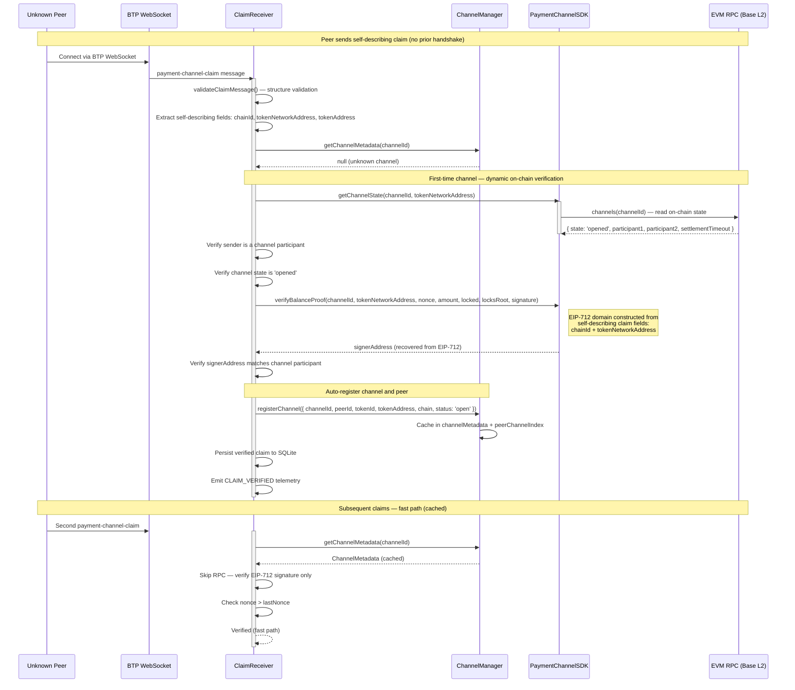

# Core Workflows

## Packet Forwarding Workflow (Multi-Hop)

The following sequence diagram illustrates the core ILP packet forwarding flow through multiple connector hops with telemetry emission:

## Per-Hop BLS Notification Pipeline

Every connector in the path can notify its local Business Logic Server (BLS) when a packet transits through. Intermediate hops fire-and-forget the notification (non-blocking), while the final hop awaits a fulfill/reject decision from its BLS.

### Key Behaviors

- **Intermediate hops**: `localDeliveryClient.deliver()` is called with `.catch(noop)` — no `await`, no impact on the critical forwarding path
- **Final hop**: `localDeliveryClient.deliver()` is awaited — the BLS response determines whether to return ILP FULFILL or ILP REJECT
- **Same payload**: Every BLS receives the same `PaymentRequest` format (`paymentId`, `destination`, `amount`, `expiresAt`, `data`) regardless of hop position
- **No packet modification**: The ILP packet is forwarded unchanged to the next hop — the BLS notification is a pure side-effect
- **Failure isolation**: If a fire-and-forget POST fails at an intermediate hop, the packet forwarding is unaffected

## Telemetry and Observability Workflow

**Note:** Dashboard visualization deferred - see DASHBOARD-DEFERRED.md in root

## Connector Startup and BTP Connection Establishment

## EVM Settlement Routing Workflow

## Claim Exchange Workflow (Epic 17)

Off-chain balance proof exchange between peers via BTP `payment-channel-claim` sub-protocol. This is the core settlement mechanism — signed claims accumulate off-chain and are redeemed on-chain only when economically optimal.

### Key Behaviors

- **Off-chain by default**: Claims are signed balance proofs exchanged over WebSocket — no on-chain transaction per claim
- **Nonce monotonicity**: Each claim must have a higher nonce than the previous, preventing replay attacks
- **Cumulative amounts**: `transferredAmount` is cumulative (not incremental), so only the latest claim matters for on-chain settlement
- **Retry with backoff**: ClaimSender retries failed sends with exponential backoff (1s, 2s, 4s — 3 attempts)
- **Dispute resolution**: Both sender and receiver persist claims to SQLite, enabling on-chain dispute if needed
- **Deferred redemption**: ClaimRedemptionService batches claims and redeems on-chain only when gas-efficient

## Dynamic On-Chain Verification Workflow (Epic 31)

Self-describing claims enable unknown peers to send claims with embedded chain/contract coordinates. The receiver verifies the channel on-chain dynamically, eliminating the need for SPSP handshake (kind:23194/23195) and Admin API channel pre-registration.

### Key Behaviors

- **Self-describing claims**: EVMClaimMessage includes optional `chainId`, `tokenNetworkAddress`, `tokenAddress` fields — the claim carries everything needed for verification
- **First-time RPC verification**: Unknown channels trigger a one-time on-chain read to confirm the channel exists and the sender is a participant
- **EIP-712 domain from claim**: The typed data domain is constructed from the claim's own `chainId` and `tokenNetworkAddress`, not from connector config
- **Auto-registration**: Verified channels are automatically registered in ChannelManager's cache and the peer is associated
- **Cached fast path**: Subsequent claims for the same channel skip RPC and verify the EIP-712 signature directly
- **SPSP elimination**: No Nostr kind:23194/23195 exchange needed — the claim itself carries the contract coordinates
- **Admin API bypass**: No `POST /admin/peers` required to pre-register channels — dynamic verification replaces manual setup
