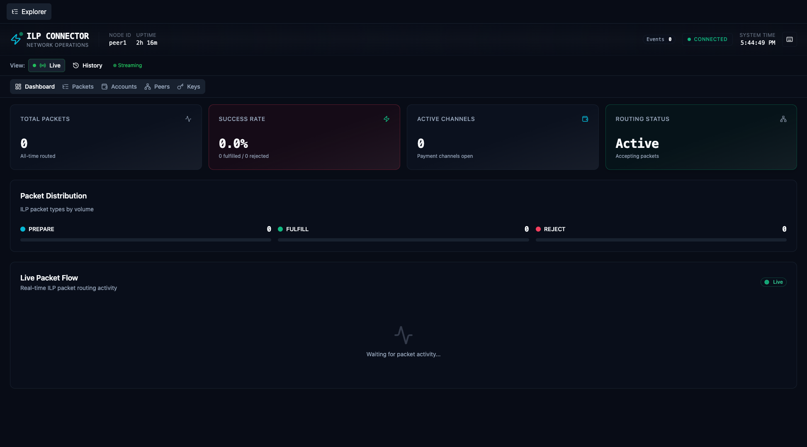

# Explorer UI User Guide

> Comprehensive guide to using the ILP Connector Explorer

The Explorer UI provides real-time visibility into your ILP connector's operations. This guide covers all features across the five main tabs: Dashboard, Packets, Accounts, Peers, and Keys.

## Table of Contents

- [Getting Started](#getting-started)
- [Dashboard Tab](#dashboard-tab)
- [Packets Tab](#packets-tab)
- [Accounts Tab](#accounts-tab)
- [Peers Tab](#peers-tab)
- [Keys Tab](#keys-tab)
- [Keyboard Shortcuts](#keyboard-shortcuts)
- [Common Workflows](#common-workflows)
- [Troubleshooting](#troubleshooting)
- [Migration Notes](#migration-notes)

---

## Getting Started

### Accessing the Explorer

The Explorer UI is served by each connector node on its configured port:

| Deployment    | Default URL           |
| ------------- | --------------------- |
| Development   | http://localhost:5173 |
| Docker Peer 1 | http://localhost:5173 |
| Docker Peer 2 | http://localhost:5174 |
| Docker Peer 3 | http://localhost:5175 |
| Docker Peer 4 | http://localhost:5176 |
| Docker Peer 5 | http://localhost:5177 |

### Connection Status

The header displays real-time connection status:

- **Connected** (green): WebSocket connection active, receiving events
- **Disconnected** (red): No connection, will auto-reconnect

---

## Dashboard Tab

The Dashboard is the default landing page, providing an at-a-glance overview of connector health.

### Metrics Grid

Four key metrics are displayed in a responsive grid:

| Metric              | Description                  | Good Value |
| ------------------- | ---------------------------- | ---------- |
| **Total Packets**   | Cumulative packet count      | Increasing |
| **Success Rate**    | FULFILL / (FULFILL + REJECT) | > 95%      |
| **Active Channels** | Open payment channels        | > 0        |
| **Routing Status**  | Routing table health         | ACTIVE     |

### Live Packet Flow

Below the metrics, a real-time visualization shows packets flowing through the connector:

- **Cyan dots**: PREPARE packets entering
- **Green dots**: FULFILL responses
- **Red dots**: REJECT responses

The animation flows left-to-right, representing packet journey through the connector.

---

## Packets Tab

The Packets tab (formerly "Events") displays detailed ILP packet telemetry.

### Packet Table Columns

| Column      | Description                         |
| ----------- | ----------------------------------- |
| Time        | Timestamp when packet was processed |
| Type        | PREPARE, FULFILL, or REJECT         |
| Amount      | Transfer amount (if applicable)     |
| Source      | Originating ILP address             |
| Destination | Target ILP address                  |
| Status      | Processing result                   |

### Filtering Packets

Use the FilterBar to narrow down displayed packets:

1. **Type Filter**: Click "ILP Packets" dropdown to filter by PREPARE/FULFILL/REJECT
2. **Search**: Type in the search box to filter by address or content
3. **Clear Filters**: Click "Clear Filters" to reset all filters

### Packet Detail Panel

Click any row to open the detail panel showing:

- Full packet headers
- Execution condition/fulfillment
- TOON-decoded data payload
- Timing information

---

## Accounts Tab

The Accounts tab shows peer account balances and settlement activity.

### Account Cards

Each account displays:

- **Peer ID**: ILP address prefix
- **Balance**: Current balance in smallest unit
- **Throughput**: Recent send/receive volume
- **Settlement Status**: Latest settlement state

### Balance History Chart

Each account card includes a balance trend chart showing:

- Historical balance over time
- Settlement spikes/dips
- Trend direction indicator

### Settlement Timeline

The settlement timeline shows:

- Payment channel opens
- Claims submitted
- Settlements completed
- Channel closes

---

## Peers Tab

The Peers tab displays connected peers and routing information.

### Peer Connection Table

| Column  | Description            |
| ------- | ---------------------- |
| Peer ID | Connector identifier   |
| Address | ILP address prefix     |
| Status  | Connected/Disconnected |
| Latency | Round-trip time        |
| Packets | Packets exchanged      |

### Routing Entries

Below the peer table, routing entries show:

- Prefix → Next Hop mappings
- Route weight/priority
- Route source (static/dynamic)

---

## Keys Tab

The Keys tab provides access to cryptographic identifiers.

### Displayed Keys

| Key         | Description                   |
| ----------- | ----------------------------- |
| Node ID     | Connector's unique identifier |
| ILP Address | This connector's ILP address  |
| Public Key  | Ed25519 public key (hex)      |
| Nostr npub  | Nostr-formatted public key    |

### Copy to Clipboard

Click the copy icon next to any key to copy it to your clipboard. A tooltip confirms the copy action.

---

## Keyboard Shortcuts

Navigate the Explorer efficiently with keyboard shortcuts:

| Key | Action                       |
| --- | ---------------------------- |
| `1` | Switch to Dashboard tab      |
| `2` | Switch to Packets tab        |
| `3` | Switch to Accounts tab       |
| `4` | Switch to Peers tab          |
| `5` | Switch to Keys tab           |
| `?` | Open keyboard shortcuts help |

Shortcuts work from anywhere in the application.

---

## Common Workflows

### Monitoring Packet Throughput

1. Open the **Dashboard** tab (press `1`)
2. Observe the "Total Packets" metric
3. Watch the Live Packet Flow for visual activity
4. Check "Success Rate" for health status

### Debugging Failed Packets

1. Switch to **Packets** tab (press `2`)
2. Filter by type: Select "REJECT" from the type dropdown
3. Click a rejected packet to see details
4. Check the rejection code and reason
5. Look at the destination address for routing issues

### Checking Peer Connectivity

1. Switch to **Peers** tab (press `4`)
2. Verify all expected peers show "Connected" status
3. Check latency values for network issues
4. Review routing entries for correct next-hop configuration

### Viewing Settlement Activity

1. Switch to **Accounts** tab (press `3`)
2. Select an account card
3. View the Settlement Timeline
4. Check for recent claims or settlements
5. Verify balance history trends

---

## Troubleshooting

### WebSocket Connection Issues

**Symptom**: Status shows "Disconnected", no events appearing

**Solutions**:

1. Check that the connector is running
2. Verify the Explorer port is correct
3. Check browser console for WebSocket errors
4. Ensure no firewall blocking WebSocket connections
5. Try refreshing the page

### Metrics Not Updating

**Symptom**: Metrics frozen, no new packets showing

**Solutions**:

1. Check WebSocket connection status
2. Verify telemetry is enabled in connector config
3. Send a test packet to trigger events
4. Check connector logs for telemetry errors

### Empty State (No Data)

**Symptom**: Tables show "No data" or "No events"

**Solutions**:

1. Wait for connector to process packets
2. Send test packets using `send-packet` tool
3. Check that telemetry buffer is flushing
4. Verify EventStore is persisting events

### Performance Issues

**Symptom**: UI slow, animations stuttering

**Solutions**:

1. Enable `prefers-reduced-motion` in OS settings
2. Clear old events (they accumulate over time)
3. Check browser dev tools for memory leaks
4. Reduce number of visible events with filters

### Console Errors

Common console errors and their meanings:

| Error               | Meaning                        | Action        |
| ------------------- | ------------------------------ | ------------- |
| `404 /api/balances` | Expected - API not implemented | Ignore        |
| React ref warning   | Cosmetic - forwarding refs     | Ignore        |
| WebSocket error     | Connection issue               | Check network |

---

## Migration Notes

### Upgrading from Epic 12 (Previous Version)

If you're upgrading from the previous Explorer implementation, note these changes:

#### Breaking Changes

1. **Default Tab Changed**: Dashboard is now the default landing page (was Events)
2. **Tab Renamed**: "Events" tab is now "Packets" tab
3. **Keyboard Shortcuts Added**: 1-5 keys now navigate tabs

#### New Features

- Dashboard with metrics grid and live packet flow
- Staggered animations on page load
- Keyboard navigation (1-5, ?)
- Enhanced NOC color scheme
- Account balance history charts
- Settlement timeline visualization

#### Preserved Features

- Real-time WebSocket event streaming
- Packet filtering and search
- Peer connection display
- Key management interface

#### Upgrade Path

1. Stop existing Explorer dev server
2. Pull latest code with Epic 18 changes
3. Run `npm install` in `packages/connector/explorer-ui`
4. Start dev server: `npm run dev`
5. Verify Dashboard loads as default

No database migrations required - the Explorer reads from the existing EventStore.
