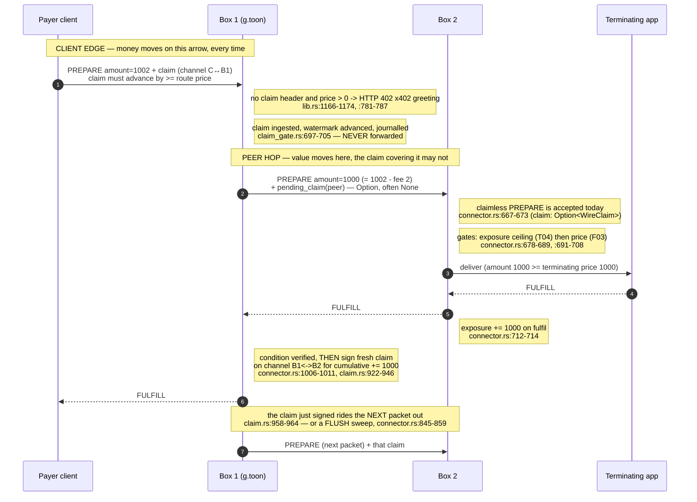

# The hop-by-hop money model

> **Superseded 2026-08-07 through 2026-08-10 by issue #868's children (ADR 0031, ADR 0033, issues
> #880/#881/#882).** This document describes the pre-#868 **credit window**: a peer PREPARE forwarded
> claimless, its claim riding the next packet or a FLUSH, bounded by a per-channel exposure ceiling.
> That model is retired as a _decision_, and [ADR 0042](../adr/0042-a-packet-carries-its-claim.md)
> now states the rule that replaces it: a packet carries its claim. **Corrected 2026-08-17:** an
> earlier version of this banner said "current behaviour: every peer PREPARE carries its own
> covering claim… everything it lists has landed." Neither was true. Issue #881's send-side covering
> was never wired to config, and the price gate requires a covering claim only at a _priced
> termination_ — so for **forwarding**, the trailing-claim model described below was still what the
> binary did. **Corrected again 2026-08-20 (issue #1056): #881 has landed** — `[[pay_channels]]`
> populates `outbound_client_hops` and a connector covers the PREPAREs it sends
> (`connector-cli/src/runtime.rs`'s `wire_outbound_client_hops`). **Corrected again 2026-08-24
> (issue #1077):** the two items this banner last listed as unbuilt are both resolved —
> **requiring** a covering claim on _forwarded arrivals_ shipped in #1142 (per-peer
> `forwarded_claim_enforcement`, defaulting to `"observe"`, so it binds no deployed box until an
> operator flips a peering), and `ClaimEnforcement::Observe` is **deleted**, `claim_enforcement`
> now being a config key parsed only to be rejected by name. Read ADR 0042's "What must be true for
> this record to be true" for what is left; that record, not this banner, is the authority. There is no exposure tracking and no
> `flush_interval_ms` (ADR 0033); those really are gone.
>
> **Superseded by [`payment-spec.md`](payment-spec.md)**, which describes what money does now. This
> document is history and is not maintained against the binary. It was renamed to
> `money-model-pre-868.md` on 2026-08-20 precisely because this banner had gone stale twice in three
> days: a filename holds without upkeep, a banner does not.

How value actually moved across a forwarded packet, end to end, **under the pre-#868 credit
window**: which claim was signed, by whom, on which channel, and at which instant. Written for
issue #865, because the pieces existed in seven
places — `peer-carriage-spec.md`, `peer-semantics-pre-868.md`, ADR 0004, ADR 0028, `devnet-pricing.md`,
`CONTEXT.md`, `README.md` — and nothing joined them, and the repo had no diagram at all.

Every claim below is cited to a line this document's author opened and read on 2026-08-07, against
`main` at `275ff378`. Line numbers drift; the citation is a pointer to a named item (a function, a
field, a check), and the name is the durable part.

**Terminology.** "Box 1" is the connector a client sends to first — on the devnet fleet this worked
example describes, that was the apex ("the g.toon box"), retired by issue #872 (toon-meta#310 /
toon-meta#313's live cutover). Nothing answers at bare `g.toon` any more; it remains only the
namespace root. "Box 2" is the box box 1 forwards to. Peer ids (`apex-store`, `apex-relay`), config
keys and ILP addresses (`g.toon.ario`, `g.toon.relay`) are wire and config identifiers from that
retired topology and appear verbatim as history — see `docs/devnet-pricing.md`'s "The apex forward
(retired)" for the current, apex-free shape.

## The model in one paragraph

A client pays **the first connector it reaches**, once, for the whole route — a forwarded route is
priced at that connector's own client edge, not just a terminating one
(`crates/connector-runtime/src/connector.rs:1217-1231`). That inbound client claim is consumed and
journalled where it lands and is **never relayed onward**
(`crates/connector-client-edge/src/claim_gate.rs:697-705`). Box 1 then forwards the packet carrying
`amount − fee` (`crates/connector-domain/src/fee.rs:19-22`) and, separately, pays box 2 with a
**fresh claim of its own**, signed on a **different channel with different participants**
(`crates/connector-runtime/src/claim.rs:868-954`). That second claim is signed only after box 2
returns a fulfilment that matches the packet's own execution condition
(`connector.rs:1006-1011`), so it can only ride the **next** packet out to that peer
(`claim.rs:958-964`). The gap between value delivered and value claimed is **exposure**, bounded by
a per-channel ceiling (`crates/connector-domain/src/projection.rs:163-174`).

## The diagram



The same thing without mermaid, with the money annotated per arrow:

```
   payer client            box 1 (g.toon)              box 2                 terminating app
        |                        |                        |                          |
        |  PREPARE 1002          |                        |                          |
        |  + CLAIM on C<->B1  ==>| money moves HERE,      |                          |
        |     (must cover 1002)  | every packet, always   |                          |
        |----------------------->|                        |                          |
        |                        |  PREPARE 1000          |                          |
        |                        |  (1002 - fee 2)        |                          |
        |                        |  + claim IF one is     |                          |
        |                        |    pending (often not) |                          |
        |                        |----------------------->|  deliver 1000            |
        |                        |                        |------------------------->|
        |                        |                        |<-------- FULFILL --------|
        |                        |<------- FULFILL -------| exposure += 1000         |
        |<------- FULFILL -------|                        |                          |
        |                        | sign fresh claim on    |                          |
        |                        | B1<->B2 for +1000;     |                          |
        |                        | it rides packet N+1 ==>| money moves HERE,        |
        |                        |                        | one packet late          |
```

Two independent money movements, on two different channels, with two different pairs of
participants. The client's claim never leaves box 1. Box 1's claim to box 2 is box 1's own money.

## Stage 1 — the client edge: a covering claim per frame, or a 402

Pricing and gating share one lookup. `Connector::client_route` answers price, transport policy and
route kind for whichever configured route the destination resolves to, and it answers for a
**forwarded** route as readily as a terminated one — `ConfiguredTarget::Peer` reports
`self.peer_routes[index].price()` with `kind: ClientRouteKind::Forwarded`
(`crates/connector-runtime/src/connector.rs:1217-1231`). That is ADR 0028: carriage is priced at the
client edge. A `PeerRoute` therefore carries two separate numbers — `price`, what this connector's
client edge charges a client (`crates/connector-runtime/src/route.rs:68-74`), and `fee`, what this
hop retains (`route.rs:62-66`).

The edge then does three things, in this order
(`crates/connector-client-edge/src/lib.rs:1143-1198`):

1. **Transport policy**, before payment is considered at all (`lib.rs:1153-1164`).
2. **The greeting.** `if !has_claim_header && (price > 0 || !condition_present)` returns
   `payment_required(...)` (`lib.rs:1166-1174`) — HTTP `402 PAYMENT_REQUIRED` with the x402 terms as
   both body and `Payment-Required` header (`lib.rs:781-787`). `has_claim_header` is the presence of
   either claim header (`lib.rs:1122-1123`); presence alone suppresses the greeting, and the claim's
   actual validity is the next step's job.
3. **The claim gate.** `extract_and_validate_claim` rejects the packet before it is routed
   (`lib.rs:1191-1198`), so an app is never asked to do work that was not validly paid for.

The gate itself is `ClientClaimGate::ingest` (`crates/connector-client-edge/src/claim_gate.rs:697-705`):
structure, then freshness/watermark, then **value against `price`**, then — last — the signature
against the counterparty this connector records for the channel the claim names (`claim_gate.rs:727-763`).
The value rule is `validate_price` (`crates/connector-domain/src/claim.rs:84-95`): the claim's
`cumulative_amount` must advance past the channel's prior watermark by **at least the route's price**.
It is evaluated twice — once up front and once authoritatively under the write lock immediately
before the watermark advances (`claim_gate.rs:738`, `claim_gate.rs:773`) — so two concurrent claims
on one channel serialise. Acceptance is not visible to the caller until the journal batch carrying it
has fsync'd (`claim_gate.rs:702-704`).

**There is no way to turn this off.** The crate says so at the top: pay-to-write "is absolute for a
priced route — there is no configuration, flag or build profile that disables any of §1.3's checks"
(`crates/connector-client-edge/src/lib.rs:26-31`).

**The inbound claim is consumed, not forwarded.** Nothing in the forward path reads it. The value it
carries becomes box 1's own money the moment its watermark advances; what box 1 owes box 2 is a
separate debt on a separate channel, settled by a separate claim it signs itself.

## Stage 2 — the forward: `price − fee`, and the fresh outbound claim

`Connector::forward_via_peer_route` (`connector.rs:969-1026`) is the whole of it:

1. **Arithmetic.** `amount_after_fee(prepare.amount, peer_route.fee(), minimum_delivery)`
   (`connector.rs:976-977`) is a flat subtraction, never a percentage
   (`crates/connector-domain/src/fee.rs:19-22`), and returns `None` if the result would fall below
   the sender's declared minimum delivery — in which case this hop rejects `R01` rather than
   forwarding short (`connector.rs:978-989`, and `fee.rs:14-18` for why: no downstream hop ever
   increases an amount, so the shortfall only grows).
2. **Attach whatever claim is already owed.** `let pending_claim = self.claims.pending_claim(peer_id)`
   (`connector.rs:996`), passed to the transport (`connector.rs:997-1000`). This is an `Option`, and
   frequently `None` — see the next section.
3. **Acknowledge.** If a claim did ride, its outcome updates the ledger (`connector.rs:1001-1003`,
   `claim.rs:1017-1034`).
4. **Sign a fresh claim, but only on a verified fulfilment.** `Self::accept_if_fulfilled` checks the
   returned preimage against this packet's own execution condition, and only then does
   `record_fulfillment(peer_id, forwarded_amount, now)` run (`connector.rs:1006-1011`). ADR 0004:
   value moves on fulfilment, never on a forward that merely returned a fulfilment-shaped answer.

`ClaimBook::record_fulfillment` (`claim.rs:868-954`) is where box 1's own money is committed. It
looks up the channel this connector claims against **for that peer** (`claim.rs:874`), advances a
cumulative watermark and a nonce — `ledger.cumulative_amount += amount; ledger.nonce += 1;`
(`claim.rs:922-923`) — signs over that channel's own binding (EIP-712 for an EVM channel, an ed25519
balance-proof message for a Solana one, `claim.rs:924-938`), arms the result as **pending**
(`claim.rs:945-946`) and journals it (`claim.rs:947-952`). Exactly one claim per call, never batched:
a second fulfilment before the first claim went out simply supersedes it with a fresher nonce and a
higher cumulative amount (`claim.rs:859-862`).

## Stage 3 — arrival on the peer semantics

`Connector::handle_peer_prepare` (`connector.rs:667-673`) takes:

```rust
pub async fn handle_peer_prepare(
    &self,
    prepare: Prepare,
    minimum_delivery: u64,
    claim: Option<WireClaim>,
    channel_id: Option<String>,
) -> (PacketResponse, ClaimAckOutcome)
```

`claim` is an `Option`, and `None` is **not** an error: it yields `ClaimAckOutcome::NotSent` and the
packet proceeds (`connector.rs:674-676`). A present claim is verified independently of the PREPARE it
rode in on — a rejected claim does not reject the packet (`connector.rs:641-643`,
`claim.rs:1091-1094`).

Two gates then run, in this order:

- **`T04_INSUFFICIENT_LIQUIDITY`** if this channel is over its exposure ceiling
  (`connector.rs:678-689`).
- **`F03_INVALID_AMOUNT`** if the destination resolves to one of this connector's own priced
  _terminated_ routes and `prepare.amount < route.price` (`connector.rs:691-708`). The lookup is the
  same `client_route` the client edge prices with, so a peer-role arrival and a client arrival are
  charged the same number. A route priced at `0` never trips it.

On a fulfilment, the receiving side records what it just delivered on the sender's behalf:
`self.claims.record_inbound_delivery(channel_id, amount)` (`connector.rs:712-714`,
`claim.rs:844-849`) — a durable journal entry, written before the in-memory projection reflects it.

## The credit window: why payment across a hop is in arrears

`pending_claim` reads `ledger.pending` (`claim.rs:958-964`). `ledger.pending` is armed **only** by
`record_fulfillment` (`claim.rs:945-946`), which runs only after a verified FULFILL
(`connector.rs:1006-1011`), and is cleared by `acknowledge_outbound` once the peer accepts it
(`claim.rs:1029-1032`). The doc comment on `outbound_cumulative_amount` states the consequence
plainly: `pending_claim` "answers `None` once the most recent claim has been acknowledged"
(`claim.rs:966-970`).

So on the peer path the forward path **emits claimless PREPAREs by construction**. There is no code
path by which box 1 can sign a claim for the packet it is about to send; it can only attach a
watermark armed by a prior fulfilment. Packet N's claim rides packet N+1.

**This is the purpose of the credit window, and the reason the ceiling exists at all.** The window is
not a tolerance knob bolted onto an otherwise-paid path — it is the thing that makes pay-in-arrears
possible across a hop. If a hop could only forward what it had already been paid for, and it can only
be paid for a packet after that packet fulfils, no first packet could ever move. The ceiling is the
bound on how much a payee will extend before it stops.

Two mechanisms close the window:

- **The next packet.** Traffic to that peer carries the pending claim forward (`connector.rs:996`).
- **A FLUSH sweep**, for when traffic stops. `Connector::sweep_flush` sends a FLUSH frame for every
  peer whose claim has waited at least `flush_interval` since it armed (`connector.rs:845-859`,
  `claim.rs:990-1009`) — the mechanism that bounds _trailing_ exposure rather than leaving a claim to
  ride a PREPARE that may never come. Configured per relation as `flush_interval_ms`
  (`crates/connector-config/src/peer.rs:458-462`).

## Exposure and the ceiling

**Exposure** is delivered-minus-claimed, per channel:

```rust
pub fn exposure(&self, channel_id: &str) -> u64 {
    let fulfilled = self.inbound_fulfilled.get(channel_id).copied().unwrap_or(0);
    let claimed = self.inbound_claimed.get(channel_id).copied().unwrap_or(0);
    fulfilled.saturating_sub(claimed)
}
```

(`crates/connector-domain/src/projection.rs:163-167`.) It is derived by folding the journal, not
stored independently (`claim.rs:470-473`).

**The ceiling test is strictly greater-than:**

```rust
pub fn is_over_ceiling(&self, channel_id: &str, ceiling: u64) -> bool {
    self.exposure(channel_id) > ceiling
}
```

(`projection.rs:172-174`.) Two consequences worth stating out loud:

- `ceiling = 0` does **not** mean "no credit". The check runs _before_ the packet is handled
  (`connector.rs:678-689`), when exposure for a first packet is still `0`, and `0 > 0` is false — so
  one uncovered packet is admitted before `T04` can fire.
- **A channel with no ceiling configured is never over one.** `ClaimBook::is_over_ceiling` returns
  `false` for a channel absent from its `ceilings` map (`claim.rs:828-836`).

That second point is where config and runtime read differently, and the difference matters. The
config accessor is `ceiling: Option<u64>` (`crates/connector-config/src/peer.rs:380`, accessor at
`peer.rs:454-456`), and its doc comment says `None` means "the runtime's own default"
(`peer.rs:450-451`). **There is no such default.** The wiring only ever calls
`with_channel_ceiling` when `peer.ceiling()` is `Some` (`crates/connector-cli/src/runtime.rs:654-661`),
so a `None` ceiling never reaches `ClaimBook::set_ceiling` (`claim.rs:628`), and `is_over_ceiling`
answers `false` forever. **`None` is unbounded in effect.** The comment at `runtime.rs:651-653` is
the accurate one: "a peering with no explicit ceiling has none here either".

Config load closes the worst half of that hole: an **accept-only** peering (no `endpoint`, so this
connector can never dial it and can never prompt a payer that has stopped sending) is refused at load
with `AcceptOnlyPeerWithoutCeiling` if it has no ceiling
(`crates/connector-config/src/peer.rs:561-563`) — "a defaulted one there is an unowned credit
decision" (`peer.rs:556-560`). A dialable peering with no ceiling still loads, and is still
unbounded.

## Where a claim's signer is decided

Never by the claim. `ClaimBook::verify_signature` (`claim.rs:1055-1089`) reads the trusted key out of
this connector's **own** record of the channel the claim names:

- **EVM**: the channel's on-chain id and EIP-712 domain come from `channel_domains`
  (`claim.rs:1058-1061`) and the address the recovered signer must match comes from `counterparties`
  (`claim.rs:1062-1064`); `verify_evm_balance_proof` is then given that address, not the claim's
  (`claim.rs:1065-1070`). The field's own doc says it: recovered from the signature, "never the
  claim's own self-declared field" (`claim.rs:439-443`). Configured by
  `ClaimBook::set_verification_key` (`claim.rs:538-540`), fed from `[[peer_channels]]` at
  `crates/connector-cli/src/runtime.rs:635-636`.
- **Solana**: the channel account bytes and `counterparty_public_key` come from `solana_channels`
  (`claim.rs:1072-1082`).

The scheme selects which map is consulted and each scheme reads only its own, so an ed25519 signature
naming a channel registered as EVM is `UnknownChannel` and cannot be made to pass by relabelling
(`claim.rs:1041-1046`). Only after the signature verifies does `accept_inbound_inner` advance the
watermark and journal the acceptance (`claim.rs:1116-1141`). The client edge reaches the same
conclusion through the same signature module, against a channel registry rather than a config map
(`claim_gate.rs:663-664`, `claim_gate.rs:752`).

## The invariant: `price − fee >= next hop price`

At each forwarding hop, what leaves must still cover what the next hop charges:

```
hop.price - hop.fee  >=  next_hop.price
```

The left-hand side is `amount_after_fee` (`fee.rs:19-22`) applied to an amount the client edge
already required to be at least `hop.price` (`crates/connector-domain/src/claim.rs:84-95`). The
right-hand side is the F03 gate on arrival: `route.kind == Terminated && route.price > 0 &&
prepare.amount < route.price` (`connector.rs:691-708`).

**The failure mode is F03 on every single write, not a subsidy.** A hop that under-forwards does not
quietly absorb the difference — it hands the next hop an amount that hop refuses, so the packet dies
at the far end, after the client has already been charged at the near end and after the near hop has
already committed to carry it. It fails identically on the first packet and the millionth; there is
no traffic level at which it starts working. `docs/devnet-pricing.md`'s "Why the relay route is 1 and
a store write is 1000" records an owner decision taken precisely to keep this arithmetic solvent.

Note what the invariant is **not**: it is not enforced anywhere at config load. Nothing in
`connector-config` compares one box's `price − fee` against another box's `price`, because no box can
see another box's config. It is an operator obligation -- checked, while the apex's forward existed,
by `EXPECTED_APEX_FORWARD_PRICE` / `_FEE` against `EXPECTED_STORE_PRICE` (both removed by issue #872
along with the apex and the peering they guarded -- see `docs/devnet-pricing.md`'s "The apex forward
(retired)") -- and by the free `GET /ilp/routes/price?destination=…` answer each surviving box still
gives for its own terminating route.

## Worked example: `g.toon.ario` on the devnet fleet (historical -- apex retired, issue #872)

The concrete arithmetic below describes a two-hop forward (apex to store box) that no longer exists
on this fleet; both boxes terminate their own prefix directly now (`docs/devnet-pricing.md`). Kept as
the clearest illustration of the invariant this whole section explains, not as a description of the
current topology.

Numbers from the committed table as it stood before #872 (`docs/devnet-pricing.md`'s "The apex
forward (retired)"); base units of 6-decimal USDC.

| Leg                                           | price | fee | Result                                      |
| --------------------------------------------- | ----- | --- | ------------------------------------------- |
| box 1 `g.toon.ario` — forward to `apex-store` | 1002  | 2   | charges client 1002, forwards 1000, keeps 2 |
| store box `g.toon.ario` — terminate           | 1000  | —   | receives 1000, `1000 >= 1000`, delivers     |

Walking one write:

1. Client sends a PREPARE for `g.toon.ario` with `amount = 1002` and a claim on its own channel with
   box 1 advancing by at least 1002. Without a claim header it gets a 402 with these terms instead
   (`lib.rs:1166-1174`).
2. Box 1 ingests the claim (`claim_gate.rs:697-705`) — its watermark advances, the entry is fsync'd,
   the money is box 1's. The claim goes no further.
3. Box 1 forwards `1002 − 2 = 1000` (`connector.rs:976-977`) to peer `apex-store`, attaching whatever
   claim it already owed that peer — on the _first_ packet of a run, `None` (`connector.rs:996`).
4. The store box checks its ceiling (`connector.rs:678-689`), then `1000 >= 1000`
   (`connector.rs:691-708`), delivers, and on fulfilment records exposure of 1000 against box 1's
   channel (`connector.rs:712-714`).
5. Box 1 verifies the fulfilment against its own condition and signs a claim on the box-1↔store-box
   channel for cumulative `+1000` (`connector.rs:1006-1011`, `claim.rs:922-946`). That claim rides
   the next packet to `apex-store`, or a FLUSH if none comes (`connector.rs:845-859`).

Had box 1 been configured `price = 1000, fee = 2`, it would forward 998, and step 4 would answer
`F03` — on every write, forever. That is the invariant, in one line of arithmetic.

For the `g.toon.relay` leg the same arithmetic lands on `1 − 0 = 1 >= 1`
(`docs/devnet-pricing.md`'s "The apex forward") — a deliberate zero fee, because that prefix is
billed per audio frame at 49 fps and any non-zero fee would have doubled the per-frame client cost.

## Decided, and now built (#868)

> **Historical note, kept as originally written below.** This section was written the day of the
> owner decision, before any of #868's children landed, and said so explicitly at the time ("nothing
> in this section describes current behaviour... no connector source has changed"). Every item this
> section lists as a future change has since landed: #880/#881 (ADR 0031) shipped the covering-claim
> requirement on both the receive and send sides, and #882 (ADR 0033) retired the exposure machinery
> outright rather than giving it a restated purpose. The bullets below are preserved for the
> reasoning, not as an open question.

An owner decision on 2026-08-07 (issue #868) **retires the claimless peer packet**: every peer packet
must carry a covering claim, or get the 402 greeting — the same rule the client edge already
enforces. Owner's framing: _"every packet needs paid claim. anything else gets the 402 greeting."_

What that changed, relative to this document:

- **Both sides of the peer path move, not just the receiving side.** The receive side would refuse a
  claimless PREPARE where `handle_peer_prepare` (`connector.rs:667-673`) accepts one today. The
  **send** side has no mechanism to comply at all: it can only attach a watermark armed by a prior
  fulfilment (`claim.rs:958-964`), never sign for the packet in hand. That mechanism is issue #866,
  which the decision makes a hard dependency rather than an option.
- **`ceiling = 0` is not a workaround for the interim.** As shown above, `is_over_ceiling` is
  `exposure > ceiling` (`projection.rs:172-174`) and exposure is still `0` when the gate runs, so one
  uncovered packet is admitted regardless.
- **ADR 0004 inverts for the peer path.** "The claim covering it follows the fulfilment rather than
  riding the outgoing PREPARE" (`docs/adr/0004-value-moves-on-fulfilment.md:4`, restated at
  `docs/protocol/peer-semantics-pre-868.md:86`) stops being true peer-side; value and its covering claim
  would travel together.
- **`peer-carriage-spec.md` §1.5 inverts.** "A connector MUST determine role before it decodes a
  claim" (`docs/protocol/peer-carriage-spec.md:145-148`) is an ordering that exists precisely
  because claimless peer packets exist.
- **The bearer credential loses its justification.** A claim is verified against the channel's
  configured counterparty key (`claim.rs:1055-1089`), so a claim on every packet proves the sender's
  identity cryptographically on every packet — strictly stronger than a bearer token.
- **The fate of the exposure machinery, decided: removed.** #882 (ADR 0033) retired
  `record_inbound_delivery`, `ceiling` and `flush_interval_ms` outright rather than keeping either
  as a residual bound. Issue #879/PR #895 measured the throughput question the next bullet left
  open and that measurement settled it: keeping the machinery alongside a covering-claim requirement
  cost a third `fdatasync` per packet (roughly +1.8 ms at p99 at the huddles rate) for a window that
  no longer opens in normal operation, while retiring it cost nothing measurable versus what already
  shipped.
- **Measured (issue #879, PR #895):** the credit window was doing no throughput work the
  covering-claim requirement didn't already also do. `record_inbound_delivery` journalled durably on
  every fulfilment just as a claim's own acceptance did, so keeping both after #880/#881 landed was a
  second sync for no benefit — exactly what the bullet above's decision retired.

The model in the sections above described the code before #868; it is not the model in the code
today. See the banner at the top of this document — and prefer
[ADR 0042](../adr/0042-a-packet-carries-its-claim.md), which is the live authority on what a packet
carries.

## Where the fragments live

This document is the joining piece; these remain authoritative for their own scope.

| Topic                                          | Document                                                          |
| ---------------------------------------------- | ----------------------------------------------------------------- |
| Claim frames, ack, flush, exposure on the wire | `docs/protocol/peer-semantics-pre-868.md` §3.2–3.4, §5.2–5.4      |
| Carriage, roles, re-derivation of the claim    | `docs/protocol/peer-carriage-spec.md` §1.5, §2.5, §3.1, §11       |
| Client edge: greeting, claim gate, cost        | `docs/protocol/client-edge-spec.md` §1.3, §1.4, §1.6              |
| Value moves on fulfilment                      | `docs/adr/0004-value-moves-on-fulfilment.md`                      |
| Durable journal and projection                 | `docs/adr/0005-claims-are-truth-balances-are-a-projection.md`     |
| Flat per-packet fee and minimum delivery       | `docs/adr/0010-flat-per-packet-fee-and-minimum-delivery.md`       |
| Forwarded routes priced at the client edge     | `docs/adr/0028-a-forwarded-route-is-priced-at-the-client-edge.md` |
| The devnet fleet's actual numbers              | `docs/devnet-pricing.md`                                          |
